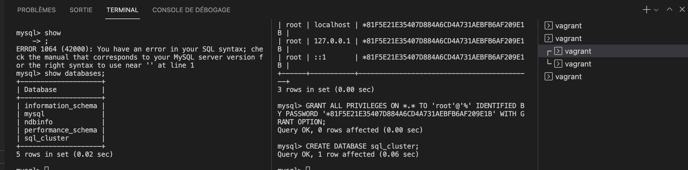

# Cluster MySQL

## Équipe

- FEUGERE Thibault
- LIJOUR Udo

## Choix technologique

Comme il l'était recommandé, nous sommes parti sur Vagrant malgré une hésitation avec Docker et son orchestrateur docker-compose.

L'hyperviseur choisit est VirtualBox.

## Configuration de VirtualBox

Bien que Vagrant automatise de nombreuses tâches, la plage d'adresse IP nécessaire doit être changé au préalable pour éviter l'erreur : 

```
The IP address configured for the host-only network is not within the
allowed ranges. Please update the address used to be within the allowed
ranges and run the command again.

  Address: 10.0.0.11
  Ranges: 192.168.56.0/21

Valid ranges can be modified in the /etc/vbox/networks.conf file. For
more information including valid format see:

  https://www.virtualbox.org/manual/ch06.html#network_hostonly
``` 

On y apprend : `On Linux, Mac OS X and Solaris Oracle VM VirtualBox will only allow IP addresses in 192.168.56.0/21 range to be assigned to host-only adapters. For IPv6 only link-local addresses are allowed. If other ranges are desired, they can be enabled by creating /etc/vbox/networks.conf and specifying allowed ranges there.`.

Cela nous concerne puisque nous sommes sur MacOs, nous avons donc créé le fichier `/etc/vbox/networks.conf` et ajouté cette ligne :

`* 10.0.0.0/24`

### Installation du Management Node (mgm_node)

On se connecte en SSH avec la commande : `vagrant ssh mgm_node`.

On passe en `root` avec la commande : `sudo su`.

On va dans le `home` de notre utilisateur, c'est-à-dire `root` : `cd ~`.

On installe `wget` et `vim` : `yum -y install wget vim`.

On installe `MySQL-Cluster` avec la commande : `wget http://dev.mysql.com/get/Downloads/MySQL-Cluster-7.4/MySQL-Cluster-gpl-7.4.10-1.el7.x86_64.rpm-bundle.tar`.

On extrait l'archive téléchargée à l'instant avec la commande : `tar -xvf MySQL-Cluster-gpl-7.4.10-1.el7.x86_64.rpm-bundle.tar`.

On supprimer les librairies `Mariadb` avec la commande : `yum -y remove mariadb-libs`.

On install `perl-Data-Dumper` avec la commande : `yum -y install perl-Data-Dumper`.

On installe `libaio.x86_64`, `libaio-devel.x86_64` et `net-tools` avec la commande : `yum install -y libaio.x86_64 libaio-devel.x86_64 net-tools`.

Puis :

```
rpm -Uvh MySQL-Cluster-client-gpl-7.4.10-1.el7.x86_64.rpm
rpm -Uvh MySQL-Cluster-server-gpl-7.4.10-1.el7.x86_64.rpm
rpm -Uvh MySQL-Cluster-shared-gpl-7.4.10-1.el7.x86_64.rpm
```

## Configuration du MySQL Cluster

Cette configuration va permettre au serveur de management de détecter tous les nœuds de notre cluster.

Création du dossier `mysql-cluster` : `mkdir -p /var/lib/mysql-cluster && cd /var/lib/mysql-cluster && mkdir /data && vim config.ini`.

La configuration est disponible dans le fichier du repo `./confs/config.ini`.

On démarre le management node :

```
[root@mgm_node data]# ndb_mgmd --config-file=/var/lib/mysql-cluster/config.ini
MySQL Cluster Management Server mysql-5.6.28 ndb-7.4.10
```

On peut désormais lancer le NDB Cluster Management Client avec la commande : `ndb_mgm`.

```
[root@mgm_node data]# ndb_mgm 
-- NDB Cluster -- Management Client --
ndb_mgm> show
Connected to Management Server at: localhost:1186
Cluster Configuration
---------------------
[ndbd(NDB)]     2 node(s)
id=2 (not connected, accepting connect from 10.0.0.21)
id=3 (not connected, accepting connect from 10.0.0.22)

[ndb_mgmd(MGM)] 1 node(s)
id=1    @10.0.0.11  (mysql-5.6.28 ndb-7.4.10)

[mysqld(API)]   2 node(s)
id=4 (not connected, accepting connect from 10.0.0.12)
id=5 (not connected, accepting connect from 10.0.0.13)
```

Ca fonctionne !

### Nous allons maintenant configurer les MySQL Cluster Data Nodes (sur data_node1 et data_node2) :

On configure le `data_node1` et `data_node2` avec les commandes :

`vagrant ssh data_node1` puis `vagrant ssh data_node2`.

On se connecte en SSH avec la commande : `vagrant ssh data_node1`.

On passe en `root` avec la commande : `sudo su`.

On va dans le `home` de notre utilisateur, c'est-à-dire `root` : `cd ~`.

On installe `wget` et `vim` : `yum -y install wget vim`.

On installe `MySQL-Cluster` avec la commande : `wget http://dev.mysql.com/get/Downloads/MySQL-Cluster-7.4/MySQL-Cluster-gpl-7.4.10-1.el7.x86_64.rpm-bundle.tar`.

On extrait l'archive téléchargée à l'instant avec la commande : `tar -xvf MySQL-Cluster-gpl-7.4.10-1.el7.x86_64.rpm-bundle.tar`.

On supprimer les librairies `Mariadb` avec la commande : `yum -y remove mariadb-libs`.

On install `perl-Data-Dumper` avec la commande : `yum -y install perl-Data-Dumper`.

On installe `libaio.x86_64`, `libaio-devel.x86_64` et `net-tools` avec la commande : `yum install -y libaio.x86_64 libaio-devel.x86_64 net-tools`.

Puis :

```
rpm -Uvh MySQL-Cluster-client-gpl-7.4.10-1.el7.x86_64.rpm
rpm -Uvh MySQL-Cluster-server-gpl-7.4.10-1.el7.x86_64.rpm
rpm -Uvh MySQL-Cluster-shared-gpl-7.4.10-1.el7.x86_64.rpm
```

On crée le fichier de configuration `my.cnf` et y mettre la configuration stockée dans `./confs/data_nodes/my.cnf` qui est :

```
[mysqld]
ndbcluster
ndb-connectstring=10.0.0.11     # IP address of Management Node
 
[mysql_cluster]
ndb-connectstring=10.0.0.11     # IP address of Management Node
```

Création du dossier `mysql-cluster` : `mkdir -p /var/lib/mysql-cluster && mkdir /data`.

On refait de même avec la machine `data_node2` (`vagrant ssh data_node2`).

On vérifie que ca fonctionne : 

```
[root@data_node1 ~]# ndbd
2022-01-14 09:40:09 [ndbd] INFO     -- Angel connected to '10.0.0.11:1186'
2022-01-14 09:40:09 [ndbd] INFO     -- Angel allocated nodeid: 2
```

```
[root@data_node2 ~]# ndbd
2022-01-14 09:40:13 [ndbd] INFO     -- Angel connected to '10.0.0.11:1186'
2022-01-14 09:40:13 [ndbd] INFO     -- Angel allocated nodeid: 3
```

### On configure les nodes SQL pour qu'ils puissent contacter le management node

On configure le `data_node1` et `data_node2` avec les commandes :

`vagrant ssh data_node1` puis `vagrant ssh data_node2`.

On se connecte en SSH avec la commande : `vagrant ssh data_node1`.

On passe en `root` avec la commande : `sudo su`.

On va dans le `home` de notre utilisateur, c'est-à-dire `root` : `cd ~`.

On installe `wget` et `vim` : `yum -y install wget vim`.

On installe `MySQL-Cluster` avec la commande : `wget http://dev.mysql.com/get/Downloads/MySQL-Cluster-7.4/MySQL-Cluster-gpl-7.4.10-1.el7.x86_64.rpm-bundle.tar`.

On extrait l'archive téléchargée à l'instant avec la commande : `tar -xvf MySQL-Cluster-gpl-7.4.10-1.el7.x86_64.rpm-bundle.tar`.

On supprimer les librairies `Mariadb` avec la commande : `yum -y remove mariadb-libs`.

On install `perl-Data-Dumper` avec la commande : `yum -y install perl-Data-Dumper`.

On installe `libaio.x86_64`, `libaio-devel.x86_64` et `net-tools` avec la commande : `yum install -y libaio.x86_64 libaio-devel.x86_64 net-tools`.

Puis :

```
rpm -Uvh MySQL-Cluster-client-gpl-7.4.10-1.el7.x86_64.rpm
rpm -Uvh MySQL-Cluster-server-gpl-7.4.10-1.el7.x86_64.rpm
rpm -Uvh MySQL-Cluster-shared-gpl-7.4.10-1.el7.x86_64.rpm
```

On crée le fichier de configuration `my.cnf` et y mettre la configuration stockée dans `./confs/sql_nodes/my.cnf` qui est :

```
[mysqld]
ndbcluster
#ndb-connectstring=10.0.0.11     # IP address for server management node
default_storage_engine=ndbcluster     # Define default Storage Engine used by MySQL
 
[mysql_cluster]
ndb-connectstring=10.0.0.11     # IP address for server management node
```

On lance désormais le service mysql avec la commande : `mysqld --user=root`.

Le terminal est monopolisé alors on en ouvre un nouveau (sans fermer l'ancien) et on récupère le secret mysql des deux nodes avec les commandes :

```
sudo su
cd ~
cat .mysql_secret
```

Le résultat sur les deux machines est : 

Sur `sql_node` :

```
root@sql_node vagrant]# cd ~
u MySQLql_node ~]# cat .mysql_secret #permet de récupérer le mot de passe généré aléatoirement pour l'utilisateur root d 
# The random password set for the root user at Fri Jan 14 09:52:06 2022 (local time): LITnBKg96DwBOZic
```

Sur `sql_node2` :

```
[root@sql_node2 vagrant]# cd ~
du MySQLl_node2 ~]# cat .mysql_secret #permet de récupérer le mot de passe généré aléatoirement pour l'utilisateur root  
# The random password set for the root user at Fri Jan 14 09:52:39 2022 (local time): KhVYaPFye5mhdTUm
```

Ce mot de passe va nous être demande pour faire l'installation et la sécurisation de mysql.

`mysql_secure_installation`

Puis on suit ces réponses :

```
mysql_secure_installation #permet de sécuriser le mysql 

You already have a root password set, so you can safely answer 'n'.

Change the root password? [Y/n] Y
New password:
Re-enter new password:
Password updated successfully!
Reloading privilege tables..

Change the root password? [Y/n] Y
New password:
Re-enter new password:
Password updated successfully!
Reloading privilege tables..
 ... Success!

Remove anonymous users? [Y/n] Y 
 ... Success!

Disallow root login remotely? [Y/n] n
 ... Success!

Remove test database and access to it? [Y/n] Y
 - Dropping test database...
 ... Success!
 - Removing privileges on test database...
 ... Success!

Reload privilege tables now? [Y/n] Y
 ... Success!

All done!  If you've completed all of the above steps, your MySQL
installation should now be secure.

Thanks for using MySQL!
```

Si on se connecte à mysql sur nos deux nodes, nous obtenons : 

Sur `sql_node` :

```
mysql> select user, host, password from mysql.user;
+------+-----------+-------------------------------------------+
| user | host      | password                                  |
+------+-----------+-------------------------------------------+
| root | localhost | *81F5E21E35407D884A6CD4A731AEBFB6AF209E1B |
| root | sql\_node | *81F5E21E35407D884A6CD4A731AEBFB6AF209E1B |
| root | 127.0.0.1 | *81F5E21E35407D884A6CD4A731AEBFB6AF209E1B |
| root | ::1       | *81F5E21E35407D884A6CD4A731AEBFB6AF209E1B |
+------+-----------+-------------------------------------------+

#on récupère le mot de passe que l'on a dans la liste ci-dessus pour donner tous les privilèges sur le MySQL
mysql> GRANT ALL PRIVILEGES ON *.* TO 'root'@'%' IDENTIFIED BY PASSWORD '*81F5E21E35407D884A6CD4A731AEBFB6AF209E1B' WITH GRANT OPTION;
Query OK, 0 rows affected (0.00 sec)
```

Sur `sql_node2` :

```
mysql> select user, host, password from mysql.user;
+------+------------+-------------------------------------------+
| user | host       | password                                  |
+------+------------+-------------------------------------------+
| root | localhost  | *81F5E21E35407D884A6CD4A731AEBFB6AF209E1B |
| root | sql\_node2 | *81F5E21E35407D884A6CD4A731AEBFB6AF209E1B |
| root | 127.0.0.1  | *81F5E21E35407D884A6CD4A731AEBFB6AF209E1B |
| root | ::1        | *81F5E21E35407D884A6CD4A731AEBFB6AF209E1B |
+------+------------+-------------------------------------------+

#on récupère le mot de passe que l'on a dans la liste ci-dessus pour donner tous les privilèges sur le MySQL
mysql> GRANT ALL PRIVILEGES ON *.* TO 'root'@'%' IDENTIFIED BY PASSWORD '*81F5E21E35407D884A6CD4A731AEBFB6AF209E1B' WITH GRANT OPTION;
Query OK, 0 rows affected (0.00 sec)
```

On remarque que le hash est identique car j'ai mis le même mot de passe (`root`) sur les deux instances.

```
[vagrant@mgm_node ~]$ sudo su
[root@mgm_node vagrant]# ndb_mgm
-- NDB Cluster -- Management Client --
ndb_mgm> show
Connected to Management Server at: localhost:1186
Cluster Configuration
---------------------
[ndbd(NDB)]     2 node(s)
id=2    @10.0.0.21  (mysql-5.6.28 ndb-7.4.10, Nodegroup: 0, *)
id=3    @10.0.0.22  (mysql-5.6.28 ndb-7.4.10, Nodegroup: 0)

[ndb_mgmd(MGM)] 1 node(s)
id=1    @10.0.0.11  (mysql-5.6.28 ndb-7.4.10)

[mysqld(API)]   2 node(s)
id=4    @10.0.0.12  (mysql-5.6.28 ndb-7.4.10)
id=5    @10.0.0.13  (mysql-5.6.28 ndb-7.4.10)
```

On veut désormais savoir si, lorsque l'on crée une table `sql_cluster` sur un node, on puisse voir la voir sur le node2.



Sur le Node Management on peut voir les stats de mémoires.

```
[root@mgm_node vagrant]# ndb_mgm -e "all report memory" #permet d'avoir l'utilisation sur les nodes
Connected to Management Server at: localhost:1186
Node 2: Data usage is 0%(25 32K pages of total 8192)
Node 2: Index usage is 0%(21 8K pages of total 16416)
Node 3: Data usage is 0%(25 32K pages of total 8192)
Node 3: Index usage is 0%(21 8K pages of total 16416)
```

## Questions :

Quel impact aura la perte du management node ? 

Il n'y aura plus de bascule vers un deuxième node lorsqu'un node sera perdu. Il y aura une désynchronisation.

Est-ce que le management node à un rôle critique dans le fonctionnement de mon cluster ? Quelle solution de secours peut-on imaginer ? 

Oui, le management node est l'élément principal dans le fonctionnement du cluster. En solution de secours, on peut imaginer la mise en place d'un double management node. Autrement dit, augmenter la redondance.

Quel est l'impact de la perte de mon DataNode1 ?

Le data_node2 va prendre le relai. 

Quel est l'impact de la perte de mon SQL node 2 ?

Le SQL node 1 n'aura plus de backup en cas de perte du data_node1.


| Evenement | Evenement attendu | Evenement obtenu |
| --------- | ----------------- | ---------------- |
|    Perte du Data Node1       |          Prise en charge par le Data Node2         | Le Data Node2 prend le relai.                 |
|      Perte de tout le cluster     | Service defectueux et inaccessible                  |      Plus aucun service n'est accessible            |
| Perte du SQL Node 1 | Prise en charge par SQL Node 2 | SQL Node2 fonctionne toujours |
| Perte du SQL Node 2 | Prise en charge par SQL Node 1 | SQL Node1 fonctionne toujours |
| Perte du management node | Impossible d'ajouter de nouveaux noeuds | Service défectueux |
| Perte du management node | Désynchronisation | Pas de synchronisation |

